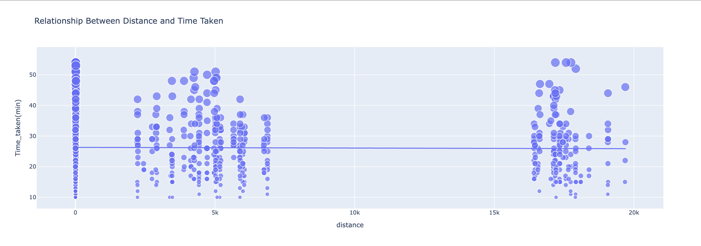

# Food Delivery Time Prediction (Python)

> Predicting delivery time (minutes) for food orders using rider/order features and the **Haversine** distance between restaurant and destination.  
> Built in a single Jupyter notebook with clear EDA and a compact Keras model.

  

---

  
  
  
  

## Table of Contents
- [Overview](#overview)
- [Dataset](#dataset)
- [Repository Structure](#repository-structure)
- [Exploratory Analysis](#exploratory-analysis)
- [Modeling](#modeling)
- [How to Run](#how-to-run)
- [Results & Example Inference](#results--example-inference)
- [Next Steps](#next-steps)
- [License](#license)

---

## Overview
- Target: **`Time_taken(min)`** — total minutes for a delivery.  
- Main features:
  - **Distance** (km) between restaurant and destination computed via **Haversine** from lat/long,
  - **Delivery partner**: `Age`, `Ratings`,
  - Context inspected in EDA: `Type_of_vehicle`, `Type_of_order`.
- Baseline model: **Keras** `LSTM → LSTM → Dense → Dense(1)` regressor.

---

## Dataset
- File: `Delivery time/deliverytime.txt` (CSV-like text with headers).
- Important columns:
  - Rider: `Delivery_person_Age`, `Delivery_person_Ratings`
  - Geo: `Restaurant_latitude/longitude`, `Delivery_location_latitude/longitude`
  - Meta: `Type_of_order`, `Type_of_vehicle`
  - Target: `Time_taken(min)`
- Engineered feature: **`distance`** (km) computed from coordinates.

> Using your own data? Keep column names or adjust paths in the notebook.

---

## Repository Structure

---

## Repository Structure
