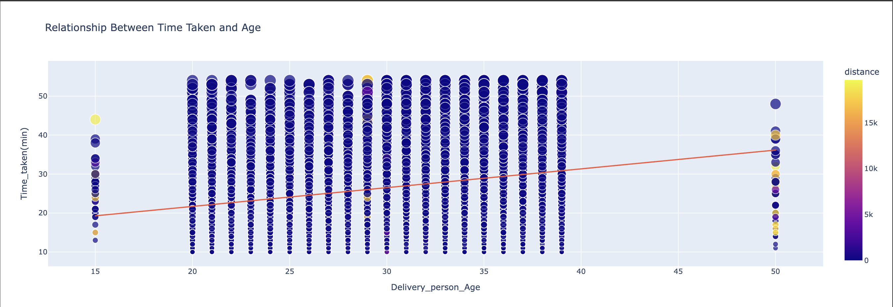
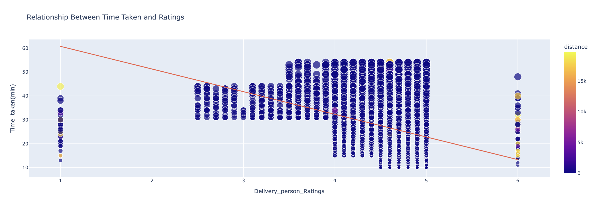
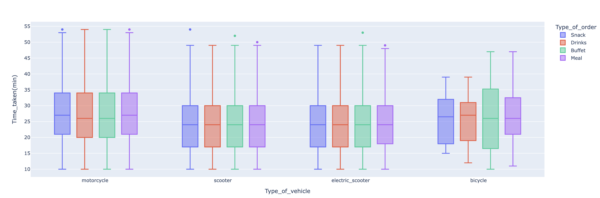
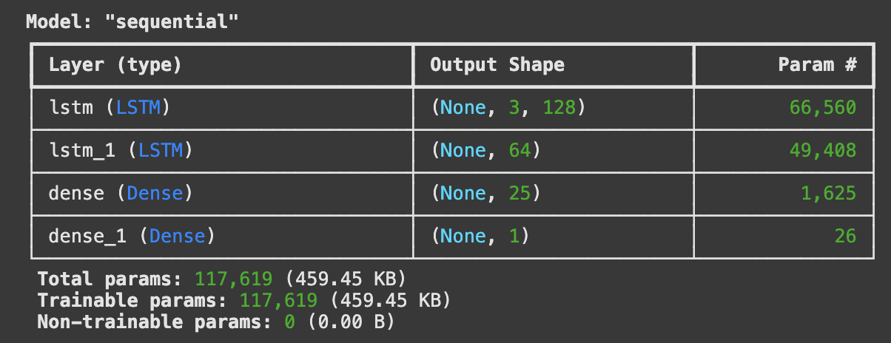
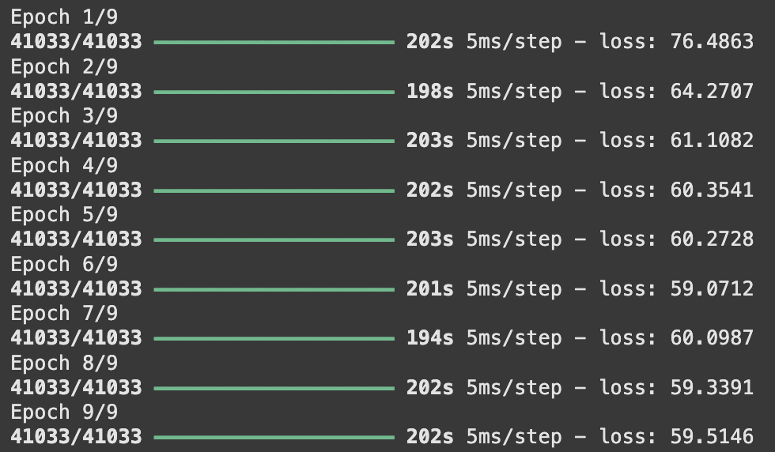

# Food Delivery Time Prediction (Python, **Google Colab**)

> Predicting delivery time (minutes) for food orders using rider/order features and the **Haversine** distance between restaurant and destination.  
> Built in a single **Google Colab** notebook with clear EDA and a compact Keras model. Works locally in Jupyter too.

  

---

  
  
  
  

## Table of Contents
- [Overview](#overview)
- [Dataset](#dataset)
- [Repository Structure](#repository-structure)
- [Exploratory Analysis](#exploratory-analysis)
- [Modeling](#modeling)
- [Run in Google Colab](#run-in-google-colab)
- [Run Locally (Optional)](#run-locally-optional)
- [Results & Example Inference](#results--example-inference)
- [Next Steps](#next-steps)
- [License](#license)

---

## Overview
- Target: **`Time_taken(min)`** — total minutes for a delivery.  
- Main features:
  - **Distance** (km) computed via **Haversine** from lat/long,
  - Rider: `Delivery_person_Age`, `Delivery_person_Ratings`,
  - Context explored in EDA: `Type_of_vehicle`, `Type_of_order`.
- Baseline model: **Keras** `LSTM → LSTM → Dense → Dense(1)` regressor.

---

## Dataset
- File: `Delivery time/deliverytime.txt` (CSV-like text).
- Important columns:
  - Rider: `Delivery_person_Age`, `Delivery_person_Ratings`
  - Geo: `Restaurant_latitude/longitude`, `Delivery_location_latitude/longitude`
  - Meta: `Type_of_order`, `Type_of_vehicle`
  - Target: `Time_taken(min)`
- Engineered feature: **`distance`** (km) computed from coordinates.

> Using your own data? Keep column names or adapt the loading cell in Colab.

---

## Repository Structure
.
├── Delivery time/
│ └── deliverytime.txt
├── pic/
│ ├── 1.png # distance vs time
│ ├── 2.png # age vs time
│ ├── 3.png # ratings vs time
│ ├── 4.png # boxplots by vehicle & order type
│ ├── 5.png # Keras model summary
│ ├── 6.png # training loss (epochs)
│ └── 7.png # sample prediction
├── Food_Delivery_Time_Prediction_using_Python.ipynb
└── .gitignore

---

## Exploratory Analysis

<table>
<tr>
<td width="50%"><b>Distance vs Time</b>  
</td>
<td width="50%"><b>Age vs Time</b>  
</td>
</tr>
<tr>
<td width="50%"><b>Ratings vs Time</b>  
</td>
<td width="50%"><b>By Vehicle & Order Type</b>  
</td>
</tr>
</table>

**Takeaways**
- Deliveries often cluster around **25–30 min**, variance grows with distance.  
- Slight **positive** trend with rider **age**.  
- Clear **negative** trend with rider **ratings**.  
- Vehicle / order type differences are modest.

---

## Modeling

**Architecture (Keras)**
Sequential(
LSTM(128, return_sequences=True) →
LSTM(64) →
Dense(25) →
Dense(1) # minutes
)

~117k trainable params

  

**Training (9 epochs, MSE decreases):**  

  

---

##Next Steps

Proper train/val/test split + report MAE / RMSE.
Compare with classic baselines: Linear/Tree/XGBoost.
Extra features: time of day, traffic proxy, weather, city zones.
Export model (SavedModel/ONNX) + small Streamlit demo.

